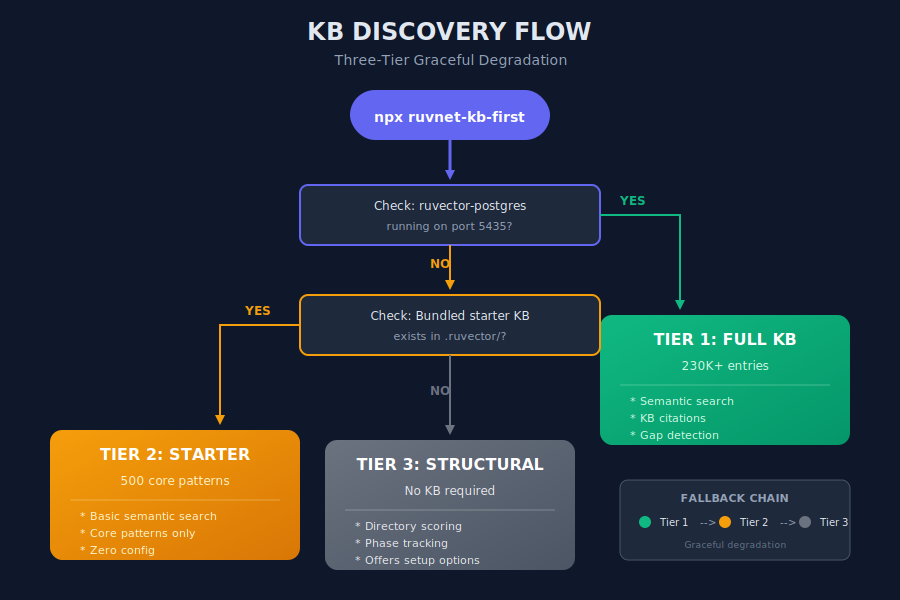
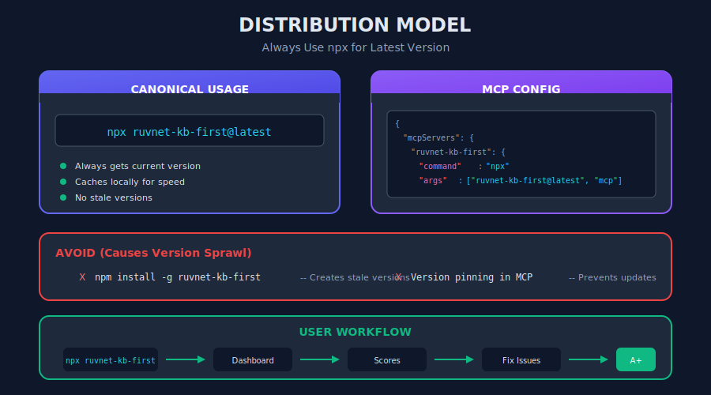

Updated: 2026-01-02 14:00:00 EST | Version 6.5.2
Created: 2026-01-01 15:28:53 EST

# RuvNet KB-First Application Builder v6.5.2

## Build Intelligent Applications on Expert Knowledge

### NEW in v6.5: Embedded WASM Knowledge Base
- **17,524 entries** embedded directly in the npm package
- **Zero infrastructure** - works offline, no PostgreSQL required
- **15-30ms search latency** (1,340x faster than PostgreSQL)
- **Auto-update detection** - knows when KB needs refresh

[](https://www.npmjs.com/package/ruvnet-kb-first)
[](https://opensource.org/licenses/MIT)

<p align="center">
  
</p>

<details>
<summary>Text Version (for AI/accessibility)</summary>

```
                     RUVNET-KB-FIRST ARCHITECTURE

  ┌─────────────────────────────────────────────────────────────────────┐
  │                                                                      │
  │   User runs: npx ruvnet-kb-first                                    │
  │                         │                                            │
  │                         ▼                                            │
  │              ┌─────────────────────┐                                 │
  │              │   KB Discovery      │                                 │
  │              │   Layer             │                                 │
  │              └──────────┬──────────┘                                 │
  │         ┌───────────────┼───────────────┐                            │
  │         ▼               ▼               ▼                            │
  │   ┌───────────┐   ┌───────────┐   ┌───────────┐                     │
  │   │  TIER 1   │   │  TIER 2   │   │  TIER 3   │                     │
  │   │  Full KB  │   │  Starter  │   │   None    │                     │
  │   │  230K+    │   │  500 ent  │   │  Struct   │                     │
  │   └───────────┘   └───────────┘   └───────────┘                     │
  │                                                                      │
  │   Fallback: Tier 1 → Tier 2 → Tier 3 (graceful degradation)         │
  │                                                                      │
  └─────────────────────────────────────────────────────────────────────┘
```

</details>

**RuvNet-KB-First** is a methodology for building applications where **curated expert knowledge drives intelligent decision-making**. Every response is grounded in verified sources. Every decision can be traced. Every gap is detected and logged.

---

## Quick Start

### One Command

```bash
# Run dashboard (shows status, scores, recommendations)
npx ruvnet-kb-first
```

### First Time Setup

```bash
# Initialize with your knowledge base
npx ruvnet-kb-first init --kb ask_ruvnet

# Or run interactive setup
npx ruvnet-kb-first init
```

### Then Ask Claude

> "Review this app using RuvNet-KB-First and recommend improvements"

---

## Embedded WASM Knowledge Base (NEW in v6.5)

The npm package now includes an **embedded WASM-based knowledge base** with 17,524 entries. This means you can use the KB without any infrastructure:

```javascript
import { loadKB, search, checkForUpdates } from 'ruvnet-kb-first/kb-data/kb-loader.js';

// Load KB (once, ~400ms)
await loadKB();

// Search (15-30ms per query)
const results = await search('how to create agents', 5);

// Check if KB needs update
const status = await checkForUpdates();
if (status.needsUpdate) {
  console.log('Run: npm update ruvnet-kb-first');
}
```

### WASM KB vs PostgreSQL

| Feature | WASM KB | PostgreSQL KB |
|---------|---------|---------------|
| Entries | 17,524 | 230,000+ |
| Setup | None | Docker required |
| Search latency | 15-30ms | ~6,700ms |
| Works offline | ✓ | ✗ |
| Auto-updates | npm update | Docker pull |

### Update Workflow

When the PostgreSQL KB is updated:

```bash
npm run kb:export   # Re-export WASM with new data
npm test            # Verify 43 tests pass
npm version patch   # Bump version
npm publish         # Publish to npm
```

---

## Three-Tier Knowledge Base System

RuvNet-KB-First uses a tiered approach to ensure it works for everyone:

<p align="center">
  
</p>

<details>
<summary>Text Version (for AI/accessibility)</summary>

```
┌─────────────────────────────────────────────────────────────────────────────┐
│                           KB DISCOVERY FLOW                                  │
├─────────────────────────────────────────────────────────────────────────────┤
│                                                                              │
│   START: npx ruvnet-kb-first                                                │
│     │                                                                        │
│     ▼                                                                        │
│   ┌─────────────────────────────────────────────────────────────────┐       │
│   │  Check: Is ruvector-postgres running on port 5435?              │       │
│   └─────────────────────────────────────────────────────────────────┘       │
│     │                                                                        │
│     ├─── YES ──► TIER 1: Full KB (230K+ entries)                            │
│     │            • All features enabled                                      │
│     │            • Semantic search, citations, gap detection                 │
│     │            • Score: KB Health + Application Scores                     │
│     │                                                                        │
│     └─── NO ───► Check: Does bundled starter KB exist?                      │
│                    │                                                         │
│                    ├─── YES ──► TIER 2: Starter KB (500 entries)            │
│                    │            • Core patterns included                     │
│                    │            • Limited but functional                     │
│                    │                                                         │
│                    └─── NO ───► TIER 3: Structural Only                     │
│                                 • Directory/file scoring only               │
│                                 • Offers setup options:                      │
│                                   [1] Set up full KB (Docker)               │
│                                   [2] Download starter KB                    │
│                                   [3] Continue in limited mode              │
│                                                                              │
└─────────────────────────────────────────────────────────────────────────────┘
```

</details>

### Tier Comparison

| Tier | Requirements | Entries | Features |
|------|--------------|---------|----------|
| **Full** | Docker + ruvector-postgres | 230K+ | All features: semantic search, citations, gap detection |
| **WASM** (NEW) | None (npm package) | 17,524 | Embedded KB, 15-30ms search, offline capable |
| **Starter** | None (bundled SQLite) | 500 | Core patterns, basic semantic search |
| **Structural** | None | 0 | Directory scoring, phase tracking, hooks only |

**v6.5 Default:** The WASM KB is now the automatic fallback when PostgreSQL is unavailable.

---

## What You See

When you run `npx ruvnet-kb-first`:

```
╔════════════════════════════════════════════════════════════════════════╗
║                      RuvNet-KB-First Dashboard                         ║
║                Build intelligent applications on expert knowledge       ║
╚════════════════════════════════════════════════════════════════════════╝

  KNOWLEDGE BASE
  ────────────────────────────────────────────────────────────────────
  ● Status:    CONNECTED
    Schema:    ask_ruvnet
    Entries:   230,721
    Host:      localhost:5435

    KB Health Score: █████████████████░░░ 85/100

  APPLICATION SCORES
  ────────────────────────────────────────────────────────────────────
    KB Coverage        ████████████████████  100/100  No code yet
    Phase Progress     ░░░░░░░░░░░░░░░░░░░░    0/100  0/12 complete
    Hooks              ████████████████████  100/100  All installed
    KB Gaps            ████████████████████  100/100  No gaps
    Documentation      ░░░░░░░░░░░░░░░░░░░░    0/100  Incomplete
    Security           ████████████████░░░░   80/100  Issues found

  ────────────────────────────────────────────────────────────────────
    OVERALL SCORE     █████████████░░░░░░░   63/100  C

  RECOMMENDATIONS
  ────────────────────────────────────────────────────────────────────
    → Complete build phases: ruvnet-kb-first phase 0
    → Add documentation: README.md, docs/api.md, docs/architecture.md
    → Fix security issues: ruvnet-kb-first verify --phase=9

  COMMANDS
  ────────────────────────────────────────────────────────────────────
    ruvnet-kb-first score --detailed   Full score breakdown
    ruvnet-kb-first status --detailed  Detailed project status
    ruvnet-kb-first verify             Run verification checks
    ruvnet-kb-first phase <n>          Execute build phase

  Ask Claude: "Review this app using RuvNet-KB-First and recommend improvements"
```

---

## Distribution Model

<p align="center">
  
</p>

<details>
<summary>Text Version (for AI/accessibility)</summary>

```
┌─────────────────────────────────────────────────────────────────────────────┐
│                        DISTRIBUTION MODEL                                    │
├─────────────────────────────────────────────────────────────────────────────┤
│                                                                              │
│   CANONICAL USAGE (Always Latest):                                          │
│   ─────────────────────────────────                                          │
│                                                                              │
│   npx ruvnet-kb-first@latest                                                │
│                                                                              │
│   WHY:                                                                       │
│   • npx caches locally but checks for updates                               │
│   • @latest ensures you always get current version                          │
│   • No global install = no stale versions                                   │
│   • Works identically on all machines                                        │
│                                                                              │
│   ─────────────────────────────────────────────────────────────────────────  │
│                                                                              │
│   MCP CONFIG (Auto-Updating):                                                │
│   ───────────────────────────                                                │
│                                                                              │
│   {                                                                          │
│     "mcpServers": {                                                          │
│       "ruvnet-kb-first": {                                                   │
│         "command": "npx",                                                    │
│         "args": ["ruvnet-kb-first@latest", "mcp"]                           │
│       }                                                                      │
│     }                                                                        │
│   }                                                                          │
│                                                                              │
│   ─────────────────────────────────────────────────────────────────────────  │
│                                                                              │
│   AVOID (Causes Version Sprawl):                                             │
│   ─────────────────────────────                                              │
│                                                                              │
│   ✗ npm install -g ruvnet-kb-first   (hard to update)                       │
│   ✗ Version pinning in MCP config    (prevents updates)                     │
│                                                                              │
└─────────────────────────────────────────────────────────────────────────────┘
```

</details>

### Why npx?

| Approach | Problem |
|----------|---------|
| `npm install -g` | Creates stale versions across machines |
| `npx ruvnet-kb-first` | Always checks for latest, caches locally |

---

## CLI Commands

| Command | Description |
|---------|-------------|
| `ruvnet-kb-first` | Show dashboard (status, scores, recommendations) |
| `ruvnet-kb-first init` | Initialize RuvNet-KB-First in project |
| `ruvnet-kb-first init --kb <schema>` | Initialize with existing KB |
| `ruvnet-kb-first status` | Show project status and phase progress |
| `ruvnet-kb-first score` | Calculate compliance score (0-100) |
| `ruvnet-kb-first score --detailed` | Show detailed score breakdown |
| `ruvnet-kb-first verify` | Run verification checks |
| `ruvnet-kb-first phase <n>` | Run or view specific phase (0-11) |
| `ruvnet-kb-first hooks` | Manage KB-First enforcement hooks |

---

## MCP Server Integration

Add to your Claude Code `settings.json`:

```json
{
  "mcpServers": {
    "ruvnet-kb-first": {
      "command": "npx",
      "args": ["ruvnet-kb-first@latest", "mcp"]
    }
  }
}
```

### MCP Tools

| Tool | Description |
|------|-------------|
| `kb_first_assess` | Establish baseline score (always first) |
| `kb_first_phase` | Get phase guidance with baseline reminder |
| `kb_first_delta` | Compare scores - blocks if regression |
| `kb_first_gate` | Pass quality gate, proceed to next phase |

---

## The Score-Driven Workflow

```
┌──────────────────────────────────────────────────────────────┐
│  1. kb_first_assess  →  Baseline: 47/100 (Grade: D)          │
│  2. kb_first_phase   →  Phase 3: KB Population tasks         │
│  3. [Do the work]    →  Add content, generate embeddings     │
│  4. kb_first_delta   →  Current: 62/100, Delta: +15 ✓ PASS   │
│  5. kb_first_gate    →  Gate passed, proceed to Phase 4      │
│  6. REPEAT           →  New baseline: 62/100                 │
└──────────────────────────────────────────────────────────────┘
```

**Key Rule:** Negative delta BLOCKS progress. No shortcuts.

---

## The 12-Phase Build Process

KB-First applications are built through a rigorous 12-phase process:

<p align="center">
  
</p>

<details>
<summary>Text Version (for AI/accessibility)</summary>

```
┌─────────────────────────────────────────────────────────────────────────────┐
│                        THE 12-PHASE BUILD PROCESS                            │
├─────────────────────────────────────────────────────────────────────────────┤
│                                                                             │
│  Phase 0         Phase 1         Phase 1.5       Phase 2                    │
│  ┌───────┐       ┌───────┐       ┌───────┐       ┌───────┐                  │
│  │ASSESS │ ────► │STORAGE│ ────► │ HOOKS │ ────► │  KB   │                  │
│  │       │       │ SETUP │       │ SETUP │       │ BUILD │                  │
│  └───────┘       └───────┘       └───────┘       └───────┘                  │
│                                                                             │
│  Phase 3         Phase 4         Phase 5         Phase 6                    │
│  ┌───────┐       ┌───────┐       ┌───────┐       ┌───────┐                  │
│  │PERSIST│ ────► │  VIZ  │ ────► │  SDK  │ ────► │SCAFF- │                  │
│  │       │       │       │       │ LAYER │       │  OLD  │                  │
│  └───────┘       └───────┘       └───────┘       └───────┘                  │
│                                                                             │
│  Phase 7         Phase 8         Phase 9         Phase 10                   │
│  ┌───────┐       ┌───────┐       ┌───────┐       ┌───────┐                  │
│  │ BUILD │ ────► │VERIFY │ ────► │SECURITY│ ───► │ DOCS  │                  │
│  │ (ENF) │       │       │       │        │       │       │                  │
│  └───────┘       └───────┘       └───────┘       └───────┘                  │
│                                                                             │
│  Phase 11                                                                   │
│  ┌───────┐                                                                  │
│  │DEPLOY │                                                                  │
│  │       │                                                                  │
│  └───────┘                                                                  │
│                                                                             │
│  ENFORCEMENT: NO SHORTCUTS • NO HARDCODED VALUES • ALL SOURCES TRACED      │
│                                                                             │
└─────────────────────────────────────────────────────────────────────────────┘
```

</details>

### Phase Summary

| Phase | Name | Purpose | Quality Gate |
|-------|------|---------|--------------|
| 0 | Assessment | Score existing KB/app | User types "PROCEED" |
| 1 | Storage Setup | Start PostgreSQL + ruvector | Connection verified |
| 1.5 | Hooks Setup | RuVector hooks for KB enforcement | Hook verify passes |
| 2 | KB Creation | Build world-class knowledge base | Score ≥98/100 |
| 3 | Persistence | Store with embeddings | Semantic search works |
| 4 | Visualization | Interactive 3D tree | Navigation works |
| 5 | Integration Layer | TypeScript SDK | All functions compile |
| 6 | Scaffold | Project structure | KB enforcement in place |
| 7 | Build | Implement with KB enforcement | No hardcoded values |
| 8 | Verification | Final check | All 8 checks pass |
| 9 | Security | Security audit & hardening | 0 critical/high issues |
| 10 | Documentation | Complete docs & versioning | All docs complete |
| 11 | Deployment | Production with public access | Go-live verified |

---

## User Scenarios

### Scenario A: Power User (Full KB)

```bash
$ npx ruvnet-kb-first

KB: ask_ruvnet (230,721 entries) on localhost:5435
Tier: FULL
All features enabled.
```

### Scenario B: New User (No Docker)

```bash
$ npx ruvnet-kb-first

No Knowledge Base detected.

Options:
  [1] Set up full KB (Docker) - recommended
  [2] Download starter KB - quick start
  [3] Continue in structural-only mode

Select [1/2/3]:
```

### Scenario C: CI/CD Pipeline

```yaml
# GitHub Actions - structural-only mode
- name: KB-First Verification
  run: npx ruvnet-kb-first verify --structural-only
```

---

## The Five Enforcement Rules

Every RuvNet-KB-First application follows these rules:

### Rule 1: KB-First Mandate
> Every response must cite KB sources or explicitly acknowledge a gap.

### Rule 2: Confidence Scoring
> Every KB result includes a confidence score (0.0-1.0).

### Rule 3: Gap Detection
> Log every query that cannot be answered from the KB.

### Rule 4: Expert Attribution
> Every KB node must trace to a named expert source.

### Rule 5: No Shortcuts
> No hardcoded domain logic. No fallback values. KB is the source of truth.

---

## Environment Variables

Configure KB connection via environment:

| Variable | Default | Description |
|----------|---------|-------------|
| `KB_HOST` | `localhost` | Database host |
| `KB_PORT` | `5435` | Database port |
| `KB_PASSWORD` | `guruKB2025` | Database password |
| `KB_MODE` | `auto` | Force mode: `full`, `starter`, `structural` |

---

## Repository Structure

```
ruvnet-kb-first/
├── bin/
│   └── kb-first.js              # CLI entry point
├── src/
│   ├── commands/
│   │   ├── dashboard.js         # Default dashboard view
│   │   ├── init.js              # Project initialization
│   │   ├── status.js            # Status display
│   │   ├── score.js             # Scoring engine
│   │   ├── verify.js            # Verification checks
│   │   ├── phase.js             # Phase execution
│   │   └── hooks.js             # Hook management
│   ├── kb-discovery.js          # Three-tier KB detection
│   └── mcp-server.js            # MCP server for Claude
├── phases/                      # Phase-by-phase instructions
├── templates/                   # Code templates
├── scripts/                     # Verification scripts
├── install/                     # Installation helpers
└── assets/                      # SVG diagrams
```

---

## Contributing

Contributions are welcome! Please read the [Contributing Guide](CONTRIBUTING.md) first.

---

## License

MIT License - see [LICENSE](LICENSE) for details.

---

<p align="center">
  <strong>Build intelligence, not just retrieval.</strong>
</p>
